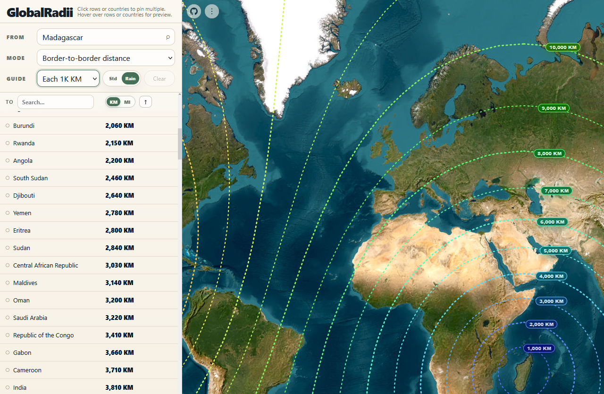
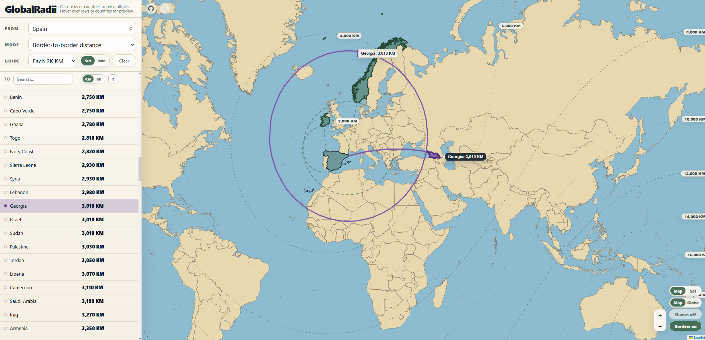
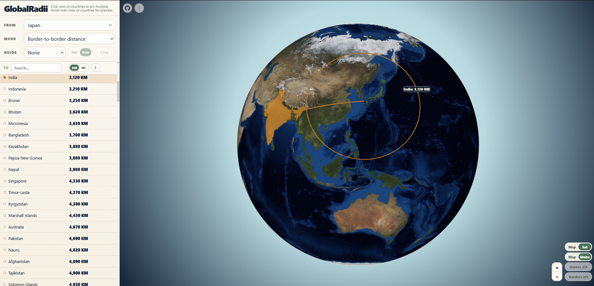
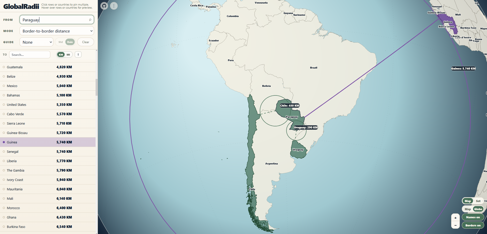

# GlobalRadii

https://brandon-valley.github.io/GlobalRadii/

GlobalRadii is a browser-based country distance visualization tool. Pick a country, switch between views, and use distance rings to visualize distances between countries.

How to use: Click the link above or open `index.html` in your browser of choice.

## Screenshots

This flat-map view shows evenly spaced distance guides radiating outward from Madagascar, which makes the regional spread easy to compare at a glance.

- 

This example highlights a specific result from Spain and previews the selected country on the map with a focused connection overlay.

- 

The globe view gives the same border-to-border distance result a more spatial, earth-scale presentation.

- 

Multiple hovered or pinned countries can be compared from the same origin, which makes quick side-by-side inspection much easier.

- 

## Easy Mobile Development

Your phone and computer must be on the same Wi-Fi network.

Run the helper script from the repo root: `serve_mobile.bat`
Follow the console output instructions to open on your mobile device.
